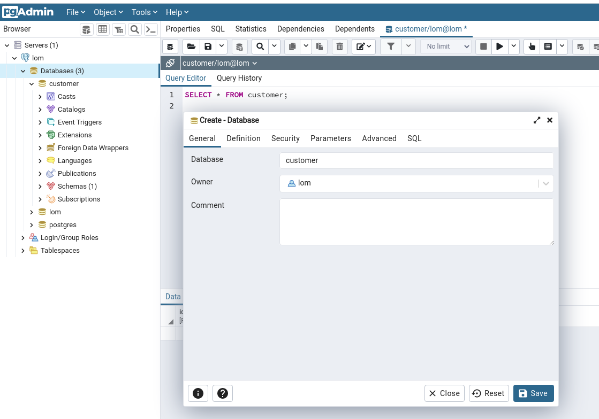
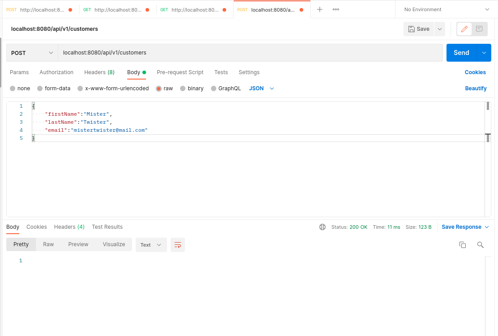

sudo docker-compose up -d

or if you want to see logs and stop them with Ctrl+c:  
sudo docker-compose up

to see what is running:  
sudo docker ps -a

http://localhost:5050  
password: password

in IDEA  
jdbc:postgresql://localhost:5432/postgres  
user:lom  
pass:password  

in PGadmin or IDEA create databases "customer" and "scammer"

run CustomerApplication with IDEA

open Postman, send POST request
url: localhost:8080/api/v1/customers
Body: raw JSON

{
"firstName":"Mister",
"lastName":"Twister",
"email":"mistertwister@mail.com"
}

in customer database:
SELECT * FROM customer;

in scammer database:
SELECT * FROM scammer_check_history;
